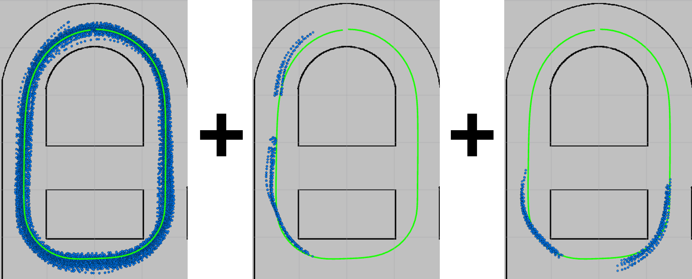
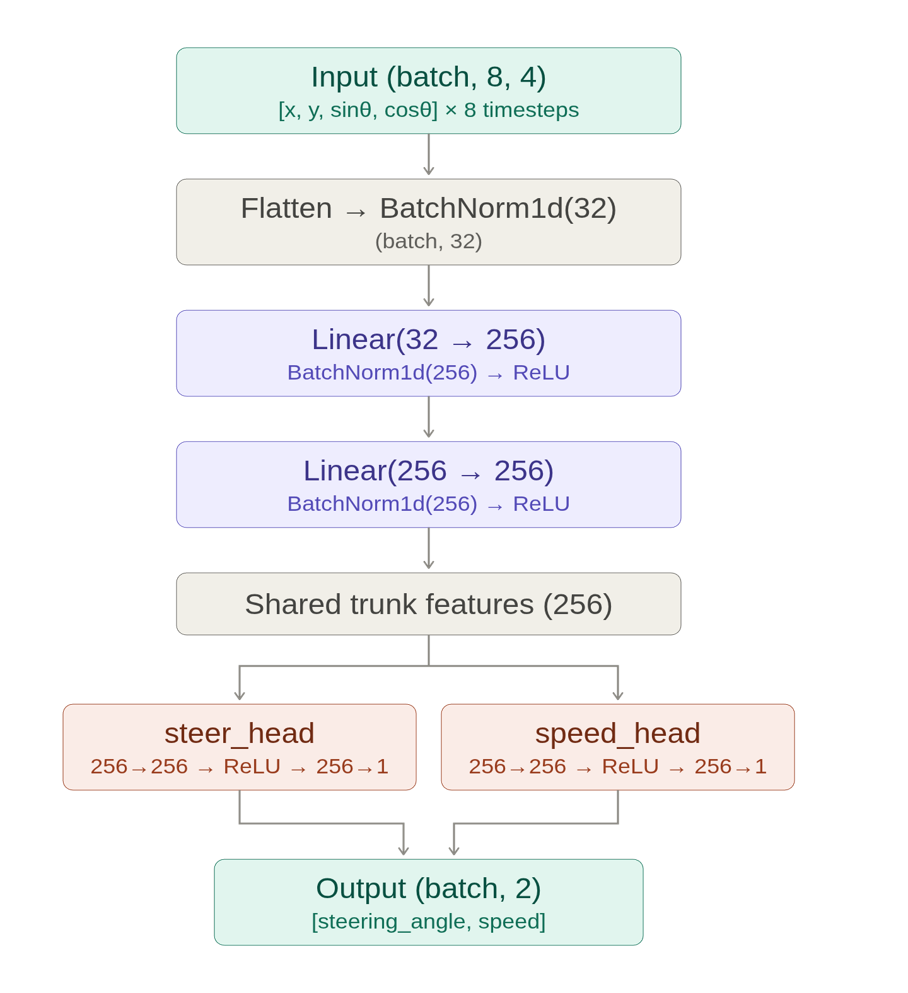
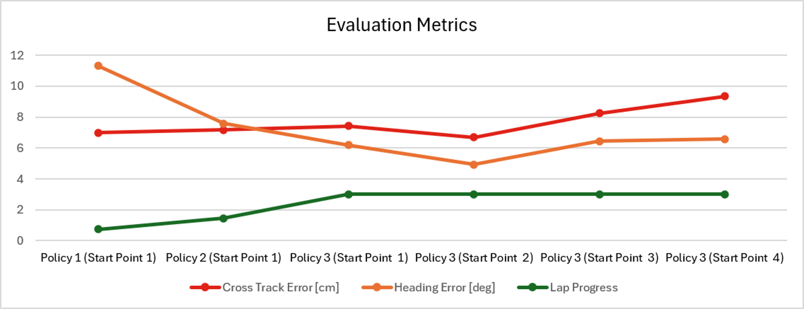
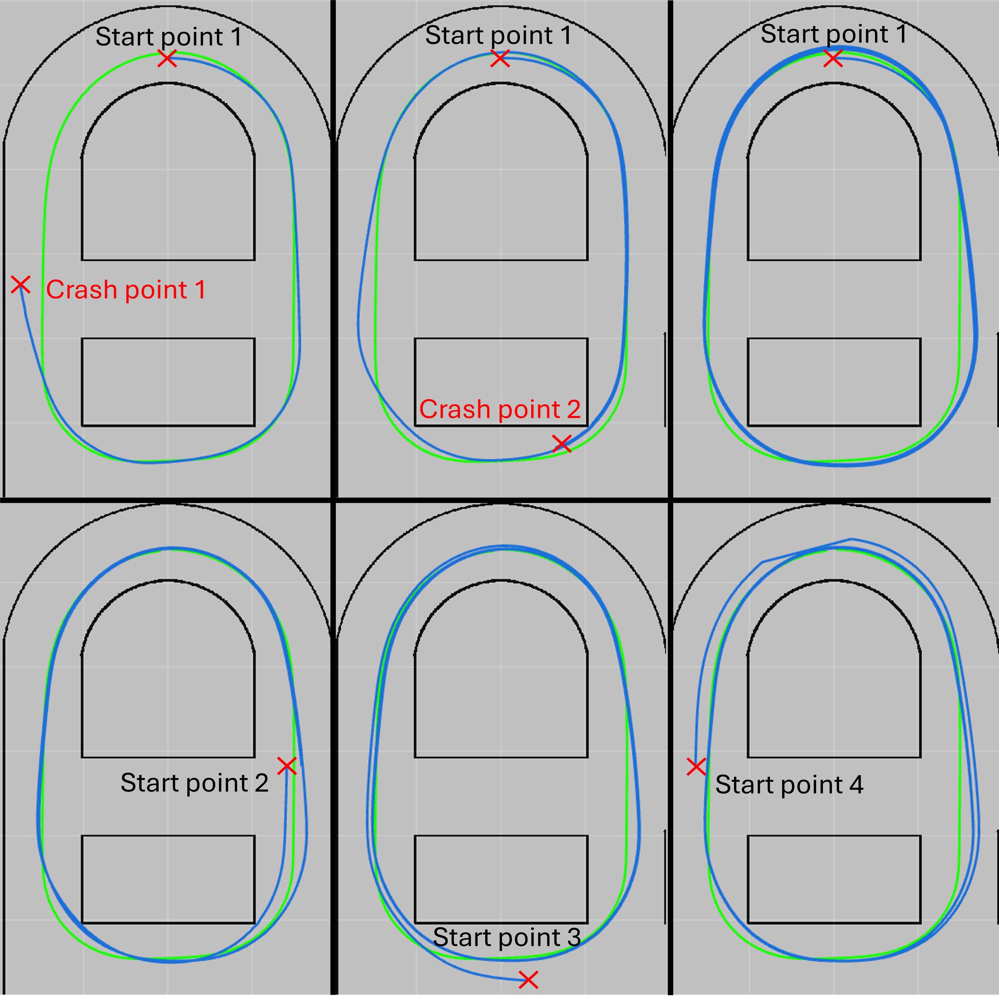

# Human-Gated DAgger on a Model Car

Imitation-learning controller that reproduces a human-driven circuit in a model city,
refined with Human-Gated DAgger iterations until it completes three consecutive
crash-free laps from multiple starting positions.

**Prepared by:** Anirudh Reddy Masireddy (Model & Training), Ben Bauerfeind (Data
Collection & Analysis) &nbsp;|&nbsp; **Supervised by:** Prof. Dr. Andreas Look
&nbsp;|&nbsp; **Repository:** <https://git.hs-coburg.de/ben8171s/Scientific_Colloquium_Dagger>

## 1. Introduction

Human-Gated DAgger addresses **covariate shift** in imitation learning: expert-only
datasets cover only a limited portion of the state space, so a cloned policy drifts into
states it has never seen and cannot recover. DAgger counteracts this by letting the
policy take control, encounter the missing states, and collect expert corrections --
expanding the state distribution with each iteration. The *human-gated* variant reduces
redundant data and expert workload: the expert intervenes only when the policy
approaches states that risk leaving the acceptable area, while keeping immediate
override in safety-critical moments.

## 2. System overview

State comes directly from the mocap bridge (`/pose_modelcars`,
`mocap4r2_msgs/RigidBodies`); commands are `ackermann_msgs/AckermannDriveStamped` on
`/ackermann_drive` (commanded, joystick or policy) and `/ackermann_drive_feedback`
(measured motor response). `ros2arduino_node` bridges `/ackermann_drive` to the motors.
The old `localization` node and `/kinematic_state` are no longer part of this pipeline.

## 3. Data collection

Training begins with an **82-lap expert dataset**, from which an average reference path
is derived. A first policy is trained on this data and deployed from a fixed starting
position to identify failure states. During policy-driven rollouts, **10 laps of human
interventions per iteration** are recorded -- both the corrective actions and the
preceding states that led to the failure. After each iteration the expert and
intervention datasets are combined and a new policy is trained and evaluated, repeating
until the policy completes three crash-free laps from four different starting positions.


*Figure 1: Recorded states (blue) for the expert dataset (left), interventions collected
during Policy 1 (middle), and Policy 2 (right), with the average path for reference
(green). The final dataset is the combination of all three.*

## 4. Model architecture



```
Input (batch, 8, 4)          [x, y, sin(heading), cos(heading)] x 8 timesteps
  -> flatten (batch, 32)
  -> BatchNorm1d(32)
  -> Linear(32 -> 256)  -> BatchNorm1d(256) -> ReLU
  -> Linear(256 -> 256) -> BatchNorm1d(256) -> ReLU
  -> shared trunk features (256)
       |- steer_head: Linear(256->256) -> ReLU -> Linear(256->1)
       |- speed_head: Linear(256->256) -> ReLU -> Linear(256->1)
  -> Output (batch, 2)       [steering_angle, speed]
```

Design rationale:

- **BatchNorm1d on the flattened input** prevents large-magnitude features (position in
  meters vs. sin/cos in [-1, 1]) from dominating the first layer, complementing the
  dataset-level z-score normalization.
- **sin(heading)/cos(heading) instead of raw heading** avoids the angle wrap-around
  discontinuity at +-pi.
- **ReLU between the Linear layers**: without a nonlinearity, stacked Linear layers
  collapse into a single linear transformation and lose the ability to model the
  non-linear relationships driving requires.
- **Shared trunk, two heads** lets steering and speed rely on shared motion features
  while still reacting differently where needed.
- **The previous command is deliberately excluded from the input**: at inference time it
  would have to be the model's own last prediction, which lets the network learn to copy
  its previous output instead of reacting to state ("causal confusion"), collapsing to a
  near-constant command once deployed.

### Training parameters

| Parameter | Value |
|---|---|
| `history_length` | 8 |
| `hidden_dim` | 256 |
| `epochs` | 80 |
| `batch_size` | 256 |
| `learning_rate` | 1e-3 |
| optimizer | Adam |
| loss | MSE |
| `drop_last` | True (BatchNorm1d needs more than one sample per batch) |
| checkpoint selection | best validation-loss epoch (deep-copied), not the final epoch |
| input normalization | z-score with train-set mean/std, saved into the checkpoint |
| validation split | separate time-based `val_prefix` holdout (preferred); random 85/15 shuffle-split only as fallback |

## 5. Trained policies

| Policy | Checkpoint | Training data |
|---|---|---|
| Policy 1 (Expert) | `model_checkpoints_demo8_Expert` | Expert demonstrations only (`demo8_train`/`demo8_val`, from `rosbag8`) |
| Policy 2 (DAgger 1) | `model_checkpoints_demo8_iv_v2` | Expert + DAgger round 1 interventions |
| Policy 3 (DAgger 2) | `model_checkpoints_dagger2` | Expert + DAgger rounds 1 + 2 interventions |

## 6. Results



Improvements are quantified with **Lap Progress**, **Cross-Track Error (CTE)**, and
**Heading Error** against the average reference path:

| Policy | Lap progress | CTE | Heading error |
|---|---|---|---|
| Policy 1 (Expert) | fails at 0.74 laps (lower-left corner) | 6.98 cm | 11.30 deg |
| Policy 2 (DAgger 1) | fails at 1.45 laps (lower-right corner) | 7.17 cm | 7.59 deg |
| Policy 3 (DAgger 2) | **3 crash-free laps** | 7.74 cm | 6.18 deg |

Across four different start points, Policy 3 still achieves three autonomous laps, with
CTE 6.69-9.34 cm and Heading Error 4.93-6.57 deg. Once the car reenters familiar states
its trajectory converges to a consistent loop.


*Figure 5: Policy-driven path (blue) over average path (green) with starting points
(red). The DAgger iterations act as targeted corrections: Policy 2 fixes the left
corner, Policy 3 resolves the right corner.*

**Takeaway:** when the expert data already spans many states around the reference path,
Human-Gated DAgger works as a precise refinement tool -- Heading Error decreases, lap
completion increases, and corner cases get fixed iteration by iteration, while CTE
(lateral precision) stays largely unchanged.

## 7. Reproducing the pipeline

Source both workspaces in every terminal first:

```bash
source /opt/ros/humble/setup.bash
source ~/ros2_ws/install/setup.bash
source ~/ros2_ws1/install/setup.bash
cd ~/ros2_ws1/src/Imitation_Learning
```

### 7.1 Record a bag

```bash
ros2 bag record -o data/<bag_name> /pose_modelcars /ackermann_drive /ackermann_drive_feedback
```

### 7.2 Build an expert dataset (`src/build_dataset.py`)

Pairs each sample from `/pose_modelcars` (filtered to `--target_rigid_body`, default `6`)
with the closest-in-time `/ackermann_drive_feedback` message using the messages' own
`header.stamp`; output size is `min(count(pose), count(feedback))`. Writes an 85:15
**time-based** train/val split (`{prefix}_train_X/_y.npy`, `{prefix}_val_X/_y.npy`):

```bash
python -m src.build_dataset --bag_path data/<bag_name> --output_prefix data/<prefix>
```

`--val_fraction 0` writes a single unsplit `{prefix}_X/_y.npy` instead.

### 7.3 Build a DAgger dataset with the command stream (`src/build_dagger_dataset.py`)

Same as above plus a third row-aligned array `z` from `/ackermann_drive` (the commanded
value), needed to detect interventions. X/y/z always have the same number of samples.
Use `--val_fraction 0`: intervention extraction needs the full recording and does its
own split.

```bash
python -m src.build_dagger_dataset --bag_path data/<dagger_bag> --output_prefix data/<prefix> --val_fraction 0
```

### 7.4 Extract intervention segments (`src/extract_interventions.py`)

Finds rows where measured (`y`) and commanded (`z`) significantly diverge = human
intervention. Auto-detects the y-vs-z steering sign relation per bag. Divergence runs
closer than `--merge_gap` rows are merged into one intervention; each segment includes
`--history_length` lead-in rows. Splits by whole segments: the trailing
`--val_segments` (default 2) go to val, the rest to train.

```bash
python -m src.extract_interventions --prefix data/<prefix> --output_prefix data/<prefix>_interventions \
    --steer_tol 0.1 --speed_tol 0.3 --merge_gap 30
```

Calibration used here: `--steer_tol 0.1 --speed_tol 0.3` reproduced the 10 real
interventions of DAgger round 1. Tolerances below normal tracking noise (e.g.
`--speed_tol 0.01`) flag nearly the whole recording as one giant segment.

### 7.5 Check the steering sign convention (`src/check_steer_sign.py`)

The feedback steering sign convention has flipped between recordings more than once
(hardware-driver edits land between bags). **Run this on every new dataset before
appending it to older data** -- a wrong sign is invisible in aggregate loss but makes
the model steer backwards exactly where the new data dominates:

```bash
python -m src.check_steer_sign data/<prefix>_train
```

Verdict is `MATCHES` / `INVERTED` / `INCONCLUSIVE`. If `INVERTED`, fix with:

```bash
python -m src.negate_steering --prefix data/<prefix>_train        # in-place mirror flip
```

(`src/negate_steering.py` also supports `--output_prefix` to write a copy instead, and
`--only positive|negative` for one-directional flips. `src/filter_positive_steering.py`
keeps only positive-steering samples and re-splits 85:15.)

### 7.6 Append DAgger data to the expert set

```bash
python3 -c "
from src.build_dataset import append_dagger_round
append_dagger_round('data/demo8_train', 'data/<prefix>_interventions_train', 'data/<combined>_train')
append_dagger_round('data/demo8_val',   'data/<prefix>_interventions_val',   'data/<combined>_val')
"
```

### 7.7 Train and evaluate

```bash
python3 train.py --data_dir data --data_prefix <combined>_train --val_prefix <combined>_val \
    --epochs 80 --output_dir model_checkpoints_<name>

python3 evaluate.py --checkpoint model_checkpoints_<name>/mlp_bc.pt --data_dir data --data_prefix <combined>_val
```

### 7.8 Drive the car (`ros_node.py`)

Subscribes to `/pose_modelcars`, keeps a rolling 8-step window, runs the model at ~33 Hz,
publishes `AckermannDriveStamped` to `/ackermann_drive` (steering clipped to +-0.5 rad,
speed to 0-1 m/s). `ros2arduino_node` must be running to reach the motors:

```bash
python3 ros_node.py --ros-args -p checkpoint:=model_checkpoints_dagger2/mlp_bc.pt
```

## 8. Notes and lessons learned

- **Absolute position input**: the model is tied to the specific track/mocap coordinate
  frame it was trained on. It does not generalize to unseen positions the way a
  frame-relative representation would -- acceptable here, limiting for richer maps.
- **Time-based validation splits only**: consecutive sliding windows overlap by
  `history_length - 1` steps, so a shuffled split leaks near-duplicate rows into val and
  inflates the metrics. Intervention extraction splits by whole segments for the same
  reason.
- **Steering sign convention is a moving target** across recordings; check every new
  bag (section 7.5) before mixing datasets.
- Datasets are `.npy`; checkpoints are `.pt` with normalization and window shape
  embedded, so `ros_node.py`/`evaluate.py` adapt to a checkpoint automatically.

## 9. Future scope

- Transfer to more complex environments (e.g. tracks with intersections where multiple
  actions are valid at the same position), relying more on heading, temporal history, or
  contextual cues than absolute position.
- Input representations that generalize across different areas of the model city.
- More reliable automatic detection of deviation from the reference path, reducing
  expert workload and triggering interventions exactly when needed.

## 10. Sources

1. Ross, S., Bagnell, D. (2010). *Efficient reductions for imitation learning.* AISTATS.
2. Ross, S., Gordon, G., Bagnell, D. (2011). *A reduction of imitation learning and structured prediction to no-regret online learning.* AISTATS.
3. Qi, C.R., Su, H., Mo, K., Guibas, L.J. (2017). *PointNet: Deep learning on point sets for 3D classification and segmentation.* CVPR.
4. Pomerleau, D.A. (1989). *ALVINN: An autonomous land vehicle in a neural network.* NIPS.
5. Codevilla, F., Mueller, M., Lopez, A., Koltun, V., Dosovitskiy, A. (2018). *End-to-end driving via conditional imitation learning.* ICRA.
6. Kendall, A., et al. (2019). *Learning to drive in a day.* ICRA.
